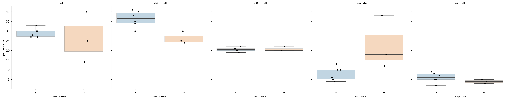

## Running
To run, download and unzip `t_tech.zip` and execute the `run.sh` script (or do `bash run.sh`). Because package management is not portable across *nix variants, this assumes that recent versions of `python` and `pip` are available on the path. Beyond that, the script will use `pip` to install the required libraries if not present and then run `cell_count.py` which does the following:
1. Produce the requested output csv, here saved as `cell-count-percentage.csv`.
2. Produce the requested plots (but see notes below), saved as `cell-count-response.csv`
3. Produce a table of relevant statistics (to stdout) for the answer to question 2b.

NB: The request was to produce a project that could be "reproducibly" run on a *nix system. There are a variety of levels of "reproducible", from a full container setup to the more minimal case provided here. For something like this in production, I would generally gravitate toward using `pixi` to manage the project environment, and specify the exact versions of all the libraries being pulled in. This would provide a decent level of reproducibility in the enivronment into the future.

I included a pixi environment specification in this project; if you already have [pixi](https://pixi.sh) installed or  wish to install it to try it out, then the project could also be run as 
`pixi run python cell_count.py < cell-count.csv`

## Python Questions
- _**1:** Please write a Python program to convert cell count in cell-count.csv to relative frequency [...]_  
  The requested csv is saved out by the script; here are the first few lines of the output:
    ```
    sample,total_count,population,count,percentage
    s1,120000,b_cell,36000,30.0
    s1,120000,cd4_t_cell,42000,35.0
    s1,120000,cd8_t_cell,24000,20.0
    s1,120000,monocyte,12000,10.0
    s1,120000,nk_cell,6000,5.0
    s2,100000,b_cell,30000,30.0
    s2,100000,cd4_t_cell,40000,40.0
    s2,100000,cd8_t_cell,22000,22.0
    s2,100000,monocyte,6000,6.0
    s2,100000,nk_cell,2000,2.0
    s3,125000,b_cell,35000,28.0
    s3,125000,cd4_t_cell,37500,30.0
    s3,125000,cd8_t_cell,26250,21.0
    s3,125000,monocyte,16250,13.0
    s3,125000,nk_cell,10000,8.0
    ```

- _**2a:** For each immune cell population, please generate a boxplot of the population relative frequencies comparing responders versus non-responders._  
  The plot is saved out, and embedded below.

  
  Note that I included the actual data points as well as the requested boxplot, since boxplots can be pretty deceptive with such low  numbers of points. 

- _**2b:** Which cell populations are significantly different in relative frequencies between responders and non-responders?_  
  The proportion of CD4 T-cells appears different between responders and non-responders, though with such a small nunber of samples (especially of nonresponders), I am hesitant to draw too firm a conclusion. Nevertheless, both a regular t-test (not shown in the table below) and Welch's t-test (which does not assume equal variance among the groups) give a p-value < 0.05, and a 95% confidence interval on the difference in the means is reasonably far from zero.
  
  The proportion of monocytes _may_ also be distinct. A regular t-test gives p=0.034, but the assumption of equal variances among samples seems violated; in contrast Welch's t-test produces p=0.2, which is more in line with the fact that a 95% CI on the difference in means includes zero. Nevertheless, just eyeballing the data there's really not much difference between the CD4 result and the monocyte result -- one changed observation for either, or one additional observation, could tip the results toward or away from significance. More data are required to say much at all about either population.

  Moreover, I'm not super-comfortable with any of those basic statistical tests, for the reason that the underlying data are proportions, which have properties that complicate the assumptions of the tests (fewer degrees of freedom since proportions sum to 100%; proportions are necessarily non-negative). This mismatch can be seen in the fact that the confidence intervals for several of these proportions (`y_ci` and `n_ci`) go into negative territory in several cases, which is not sensical for means of proportions. While there are various classical statistical tests for differences in proportions, I haven't found any for _differences in the means of several proportions_.
  
  In this case, my first recommendation would (again) be just to gather enough data such that using a slightly incorrect statistical test is no longer a major concern. But my second recommendation would be to either use a simulation-based approach to model the actual data-generation process and develop appropriate null distributions for p-value testing, or to use a Bayesian-modeling tool (e.g. `pymc`) to again model the full data-generation process and develop confidence intervals around the latent variables of interest.

  The statistical output of the script is below; columns are as follows:
    
    - `population`: the cell population
    - `p`: p-value poduced by Welch's t-test of difference in means of two independent samples
    - `y_n`: number of responders (`y` values for the response data column)
    - `y_mean`: mean proportion of this cell population among responders
    - `y_ci`: 95% confidence interval for `y_mean`
    - `n_n`, `n_mean`, and `n_ci`: same as above but for non-responders
    - `mean_diff`: `y_mean - n_mean`
    - `mean_diff_ci`: 95% confidence interval for `mean_diff`
    
    ```
    population      p  y_n  y_mean        y_ci  n_n  n_mean         n_ci  mean_diff mean_diff_ci                                                                                 
    b_cell      0.744    6    29.2  26.7, 31.6    3    26.3   -6.1, 58.8        2.8  -15.1, 20.8
    cd4_t_cell  0.010    6    36.3  32.0, 40.7    3    26.3   18.3, 34.3       10.0    4.1, 15.9
    cd8_t_cell  0.844    6    20.5  19.4, 21.6    3    20.7   17.8, 23.5       -0.2    -2.0, 1.7
    monocyte    0.200    6     8.0   4.3, 11.7    3    22.7  -11.2, 56.5      -14.7   -33.6, 4.2
    nk_cell     0.135    6     6.0    3.3, 8.7    3     4.0     1.5, 6.5        2.0    -0.8, 4.8
    ```

## Database Questions
- _**1:** How would you design a database to capture the type of information and data in cell-count.csv?_  
  I would create a two-table database, with one table containing the sample-related data/metadata (`project`, `subject`, `condition`, `age`, `sex`, `treatment`, `response`, `sample`, `sample_type`, and `time_from_treatment_start`), and a separate table containing columns for `sample`, `population`, and `count`. This way, it would be possible for different samples to contain measurements of different sets of cell populations. I suppose if someone were to swear up and down that only the above cell populations would _ever_ be measured, they could convince me to go for a one-table, wide-form schema with columns for each cell type.

  If more hierarchical data needed to be added in the future, separate tables could be broken out for `subject`, `project` and so forth. But in the current sample-centric world, the above scheme is probably a fine start and doesn't needlessly complicate things from the get-go.

  Here's a full schema, in sqlite flavor:
    ```
    CREATE TABLE sample(
        sample TEXT PRIMARY KEY, -- or we could use numeric sample IDs, but text primary keys are fine in sqlite
        project TEXT,
        subject TEXT,
        condition TEXT,
        age INTEGER,
        sex TEXT, -- could add some constraints here and elsewhere
        treatment TEXT,
        response TEXT,
        sample_type TEXT,
        time_from_treatment_start INTEGER
    );

    CREATE TABLE count(
        sample TEXT,
        population TEXT,
        count INTEGER,
        FOREIGN KEY(sample) REFERENCES sample(sample),
        PRIMARY KEY(sample, population) -- could also have a separate auto-incrementing integer primary key
    );
    ```
  Some database purists say that all primary keys should be auto-incrementing integers; there's merit to this but there are also reasonable counterpoints. Such as, in the `count` table above, having the `(sample, population)` tuple as the primary key will ensure that no duplicate measurements for a given sample and cell type get inserted. One could have other logic / constraints for that, but the whole point of something being the "primary key" is exactly that so why not use it?

- _**2:** What would be some advantages in capturing this information in a database?_  
  One classic advantage of a database is the ACID guarantees: atomicity, consistency, isolation, and durability, which together help guarantee the database remains in a consistent state in every case. In addition, if a database server is employed (i.e. not something like sqlite), multiple clients on different machines can simultaneously access the database. Last, also if a database server is in use, queries run on the server and reduce network traffic to the clients since only the subsetted / summarized data need be returned. 

  _On the other hand:_ in this case, the database is probably going to be append-only (we're unlikely to be going back and modifying the values from old samples!), which makes the ACID guarantees pretty easy to meet with anything that can guarantee atomic append or replace operations. Like any filesystem, or cloud buckets. I estimate that the metadata and count data for each sample would together probably take ~30 bytes (uncompressed if we switched to enums for the text fields, or if we used free text fields but then compressed the file). So a mere megabyte would accomodate almost 35k samples.

  Two parquet files, structured similar to the schema above, intelligently compressed and stored on cloud buckets, would support most of the use cases of an append-only database. They could be atomically updated as often as need be, and it really wouldn't use meaningfully more network bandwidth anyway since the data are so small to begin with. Moreover, since e.g. mySQL's default wire protocol is so atrocious that integers and floats are sent over as the plain text of their base-10 representations (!), getting a large subset of data from a database server can sometimes be slower than downloading the whole dataset stored as a binary file.

  In any case, this application is simple enough that _anything is fine_, so it's not worth sweating it. But I'm always in favor of at least checking one's assumptions regarding alternate options.

- _**3:** Based on the schema you provide in (1), please write a query to summarize the number of subjects available for each condition._  
  This query would actually be simpler if we had broken out a `subject` table in the schema above -- but then we would have to wrestle with the question of whether and how to support a subject having multiple conditions (potentially at different times). By just having a `sample` table we can punt and say that a subject has only one condition that is relevant to a given sample. So that's good, but then we need to handle cases where a subject is represented multiple times in the `sample` table. 

  If we weren't worried about multiple samples per subject, we could just do:
  ```
  SELECT condition, COUNT(*) FROM sample GROUP BY condition;
  ```
  But to do it properly we first select all unique `(subject, condition)` pairs to avoid double-counting samples (within a condition), and then
  group by counts:
  ```
  SELECT condition, COUNT(*) FROM (SELECT DISTINCT subject, condition FROM sample) GROUP BY condition;
  ```

- _**4:** Please write a query that returns all melanoma PBMC samples at baseline from patients who have treatment tr1._  
  To select just the relevant sample IDs, we could do:
  ```
  SELECT sample FROM sample WHERE condition="melanoma" and sample_type="PBMC" and time_from_treatment_start=0 and treatment="tr1";
  ```
  If we wanted to use these IDs to retrieve cell-count data, we could do something like:
  ```
  SELECT * FROM count WHERE sample IN (
    SELECT sample FROM sample WHERE condition="melanoma" and sample_type="PBMC" and time_from_treatment_start=0 and treatment="tr1"
  );
  ```

- _**5:** How many samples from [each project | responders/non-responders | males, females]?_  
  ```
  SELECT X, COUNT(*) FROM sample WHERE condition="melanoma" and sample_type="PBMC" and time_from_treatment_start=0 and treatment="tr1" GROUP BY X;
  ```
  replacing `X` with `project`, `response`, and `sex` for 5a-c, respectively. 